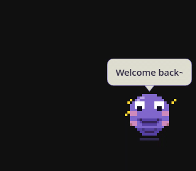

# Pip — AI Desktop Companion 

**Homepage:** https://meet-pip.netlify.app/

A tiny pixel-art character who lives in the corner of your Linux desktop.
She chats, dances to your music, reminds you to drink water, and grows a real personality the longer you hang around.
Powered by Claude Code — **no API key needed**.



---

## What she does

- **AI chat** — left-click to talk; uses your local `claude` CLI session
- **Relationship system** — grows from *New Friend* → *Best Friend* over 500+ interactions; her tone and humour actually change
- **Music awareness** — dances when a new track starts via `playerctl`; fetches artist facts
- **Games** — Trivia Quiz, 20 Questions, Rock-Paper-Scissors from the right-click menu
- **Wellness** — Pomodoro timer, hydration reminders, 4-7-8 breathing, screen-time nudges
- **Daily content** — word of the day, coding challenge, haiku, and time-aware greetings
- **Memory** — say `remember: X` to save a note; she brings it up later
- **Ambient awareness** — reacts to your clipboard, active window, CPU spikes, and weather

---

## Installation

```bash
# 0. Clone the repo
git clone https://github.com/gourab026/claude_companion.git
cd claude_companion

# 1. Install dependencies
pip install PyQt6 pynput
pip install psutil        # optional — system stats reactions
sudo apt install xdotool playerctl  # window watcher + music detection

# 2. Make sure Claude Code is installed and authenticated
claude -p "hi"            # should return a response

# 3. Run
python main.py
```

> A compositor (picom, KWin, etc.) must be running for transparency to work.

---

## Usage

| Action | Result |
|---|---|
| Left-click | Open chat |
| Double-click | Pet Pip |
| Triple-click | Minimize to a dot |
| Right-click | Context menu (games, Pomodoro, settings…) |
| Drag | Move anywhere on screen |
| `remember: X` in chat | Save a sticky note |
| `teach: word = meaning` | Teach Pip a new word |

---

## Relationship levels

| Interactions | Level | What changes |
|---|---|---|
| 0–24 | New friend | Polite and curious |
| 25–99 | Acquaintance | Warmer, more casual |
| 100–499 | Friend | Playful and personal |
| 500+ | Best friend | Teases you, writes diary entries about your day |

---

## Stack

Python 3.9+ · PyQt6 · Claude Code CLI · `playerctl` · `xdotool` · `psutil`

---

## License

[Polyform Noncommercial 1.0](LICENSE) — free for personal use, not for commercial products.
